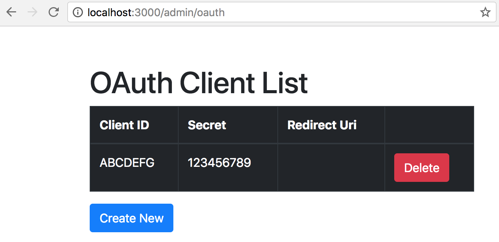
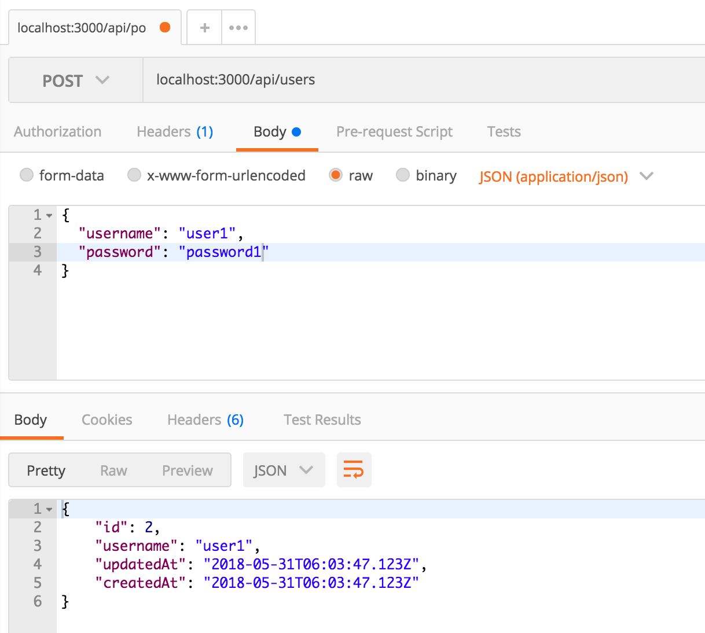
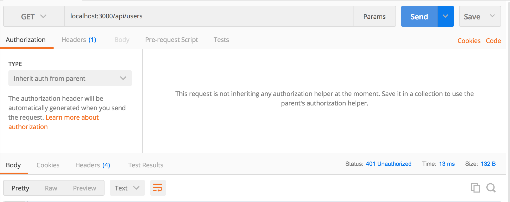
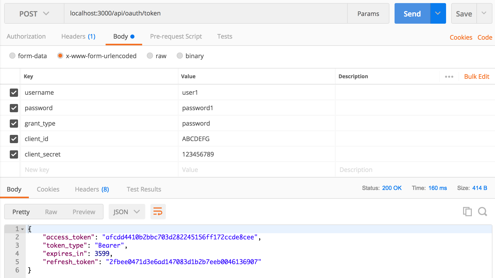
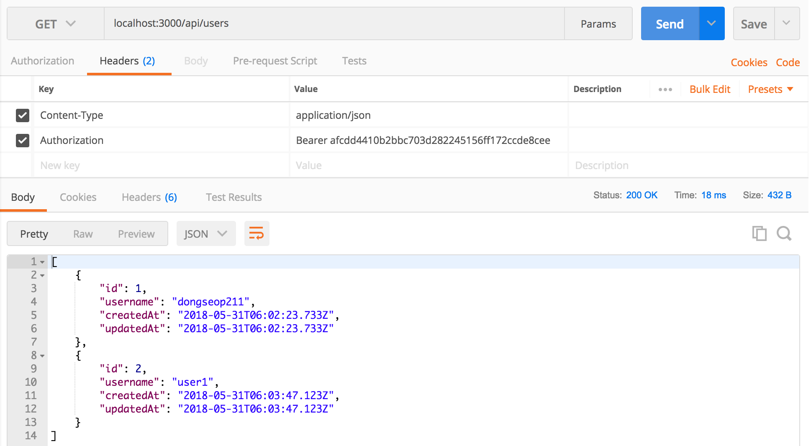
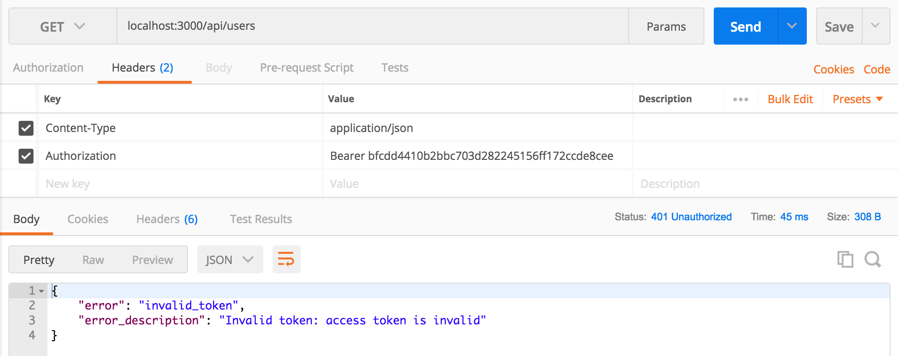

# 인증 기능 서버 구현 방법

### 사전준비

- Sequelize-cli 설치: https://github.com/sequelize/cli
- Express generator 설치
- PostgreSQL 설치
- Nodemon 설치: yarn add global nodemon

### 이 repository를 그냥 실행만 하려면?
```
$ cd server

$ yarn

$ psql postgres
  >  CREATE ROLE dbuser1 WITH LOGIN CREATEDB PASSWORD 'dbuserpwd1';

$ sequelize db:create
$ sequelize db:migrate
$ sequelize db:seed:all

```

### 이 repository처럼 새로운 프로젝트를 단계별로 제작한다면
1. DB 생성: psql을 이용하여 새로운 사용자와 DB를 만든다.

   ```sh
   $ psql postgres -U postgres
   # CREATE ROLE dbuser1 WITH LOGIN CREATEDB PASSWORD 'dbuserpwd1';
   # \q

   -- 위 명령이 안되면 다음 명령을 사용하세요.
   $ psql postgres         (MacOS의 경우 postgres role없이 본인 계정으로 생성됨)
   
   ```

2. Express Generator로 새로운 express app을 생성한다.

   ```sh
   $ yarn add global express-generator    (이 과정은 전에 했던 사람은 안해도 됨)
   $ express --view=pug --git server
   $ cd server
   $ yarn     (혹은 npm install)
   ```

3. Sequelize 추가

   ```sh
   $ yarn add global sequelize-cli    (이 과정은 전에 했던 사람은 안해도 됨)
   $ yarn add sequelize pg pg-hstore
   $ sequelize init
   
   ```

4. DB접속 설정: config/config.json

   ```JSON
   {
     "development": {
       "username": "dbuser1",
       "password": "dbuserpwd1",
       "database": "authsample_development",
       "host": "127.0.0.1",
       "dialect": "postgres"
     },
     "test": {
       "username": "dbuser1",
       "password": "dbuserpwd1",
       "database": "authsample_test",
       "host": "127.0.0.1",
       "dialect": "postgres"
     },
     "production": {
       "username": "dbuser1",
       "password": "dbuserpwd1",
       "database": "authsample_production",
       "host": "127.0.0.1",
       "dialect": "postgres"
     }
   }
   
   ```

5. Sequelize를 이용하여 DB를 생성하자.
  ```sh
  $ sequelize db:create
  ```
5. Express-oauth-server package 설치: https://github.com/oauthjs/express-oauth-server

   ```bash
   $ yarn add express-oauth-server
   ```

6. 그 외에 필요한 패키지 들을 설치하자.

   ```sh
   $ yarn add nanoid bcrypt express-basic-auth method-override
   ```

7. Sequelize-cli를 이용하여 OAuthClient와 User 모델을 만들자

   ```sh
   sequelize model:create --name OAuthClient --attributes clientId:string,clientSecret:string,redirectUri:string
   
   sequelize model:create --name User --attributes username:string,password_digest:string
   ```

8. Sequelize-cli를 이용하여 OAuthToken과 OAuthRefreshToken 모델을 생성하자.
   ```sh 
   sequelize model:create --name OAuthToken --attributes accessToken:string,expiresAt:date,scope:string,clientId:string,userId:integer
   
   sequelize model:create --name OAuthRefreshToken --attributes refreshToken:string,expiresAt:date,scope:string,clientId:string,userId:integer
   ```

   

9. migration과 model 파일을 체크하고, 필요한 수정을 하자.

10. DB를 migration 하자

  ```sh
  $ sequelize db:migrate
  ```

11. 테스트용 oauth client를 하나 생성하기 위해 seed 파일 생성
   ```sh
   $ sequelize seed:generate --name demo-oauth-client
   ```

12. Seed로 데이터를 생성하자.

   ```sh
   $ sequelize db:seed:all
   ```

   

13. 

14. 

15. 

16. 

## 실행 결과


1. Client 생성



2. 사용자 생성 



3. 인증에 의해 보호되는 API를 token 없이 접속하면 HTTP 401 Unauthorized



4. 토큰 생성



5. 토큰을 달아서 다시 API 호출하면 성공함



6. 토큰이 틀리면 API 호출 실패



